# Wavey 

## Introduction
Wavey Blog is a website built in Django using Python, JavaScript, CSS and HTML. It enables users to create and share music production techniques through tutorial-style posts with other users from around the world. It is targetted towards users who enjoy making electronic music and would like to share their knowledge with others. Once users have registered and created a profile, they have the ability to create posts, as well as like and comment on others. They can upload images and videos for use on their posts, link their personal youtube accounts and other social websites.

The site provides role based permissions for users to interact with a central dataset. It includes user authentication, email validation, and Full CRUD functionality for Posts and User Profiles.

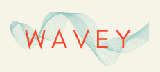

[View the live website](https://wavey.onrender.com)

Please note: To open any links in this document in a new browser tab, please press CTRL + Click.

## Table of Contents
* [User Experience Design (UX)](#UX)
    * [The Strategy Plane](#The-Strategy-Plane)
        * [Site Goals](#Site-Goals)
        * [Epics](#Epics)
        * [User Stories](#User-Stories)
    * [The Scope Plane](#The-Scope-Plane)
        * [Opportunities](#Opportunities)
    * [The Skeleton Plane](#The-Skeleton-Plane)
        * [Wireframes](#Wireframe-mockups)
        * [Database Schema](#Database-Schema)
    * [The Surface Plane](#The-Surface-Plane)
* [Features](#features)
* [Future Enhancements](#future-enhancements)
* [Technologies Used](#technologies-used)
* [Testing](#testing)
* [Deployment](#deployment)
* [Credits](#credits)

## UX
### The Strategy Plane
*  Wavey is intended to be a friendly community site for users to create and share their own music production techniques with others. Users will also be able to find posts created by other users from around the world. The graphical elements and overall design of the site provide a clear and concise environment for them to focus their attention on learning.

##### The Sites Ideal User
* Music producer of any level looking to share their favourite tips, tricks and techniques with others
* Someone looking to expand their production knowledge
* Someone looking for inspiration for new things to try when creating
* Someone looking to build their social media following

#### Site Goals

* To provide users with a place to become inspired
* To provide users with a place to share their own tips and ideas
* To provide users with a place to discover new techniques and be inspired

#### Epics

8 Epics were created which were then further developed into 38 User Stories. The details on each epic, along with the user stories linked to each one can be found in the project kanban board [here](https://github.com/YesCoops/wavey-blog/projects/1)

1. Initial Django setup [#1](https://github.com/YesCoops/wavey-blog/issues/1)
2. User Profile [#2](https://github.com/YesCoops/wavey-blog/issues/2)
3. User login [#3](https://github.com/YesCoops/wavey-blog/issues/3)
4. User posts [#5](https://github.com/YesCoops/wavey-blog/issues/5)
5. Post search [#6](https://github.com/YesCoops/wavey-blog/issues/6)
6. Post viewing [#7](https://github.com/YesCoops/wavey-blog/issues/7)
7. Post interaction [#8](https://github.com/YesCoops/wavey-blog/issues/8)
8. Site Owner objectives [#4](https://github.com/YesCoops/wavey-blog/issues/4)

### User Stories

From the Epics, 24 User stories were developed. Each story was assigned a classification of Must-Have, Should-Have, Could-Have or Won't Have. Inexperience with Django and time constraints during development left me completing 23 of the 24 User stories. I will however revisit the project at a later time for improvement. All of this information is avaialble on this [kanban board](https://github.com/YesCoops/wavey/projects/1).

These are the user stories that were completed within the projects first release, by Epic.

1. Initial Django setup
		
2. User Profile
	
3. User login
	
4. User posts
	
5. Post management

6. Post viewing

7. Post interaction

8. Site owner objectives

	
### The Scope Plane

**Features planned:**

* User Profile - Create, Read, Update and Delete
* Posts - Users can create, read, update and delete their own posts
* Other Users posts - Users can read, like, and comment on other Users' posts
* Profiles - Users can view other user profiles
* Users can login to their account, change their password or their email
* Users can reset their password if they forget it
* Users can logout of their account
* Users need to be registered and logged in to create and like posts and access other users profiles.
* Responsive Design - the site needs to be fully responsive to cover a wide spectrum of screen sizes

#### Opportunities

Arising from user stories
| Opportunities | Importance | Viability / Feasibility
| ------ | :------: | :------: |
| ** Provide users the ability to create an account ** | 5 | 5 |
| ** Provide users the ability to create posts ** | 5 | 5 |
| ** Provide users the ability to edit posts ** | 5 | 5 |
| ** Provide users the ability to view posts ** | 5 | 5 |
| ** Provide users the ability to delete posts ** | 5 | 5 |
| ** Provide users the ability to edit their account ** | 5 | 5 |
| ** Provide users the ability to view other accounts ** | 5 | 5 |
| ** Provide users the ability to delete their account ** | 5 | 5 |
| ** Provide users the ability to like a post ** | 3 | 5 |
| ** Provide users the ability to access the site on any device ** | 5 | 5 |

### The Skeleton Plane
#### Wireframe mock-ups

Wireframes were produced for each major page for desktop, mobile and tablet devices. As the site will be fully responsive, no matter the device size the user is viewing the site on, it will display accordingly.

Click for images

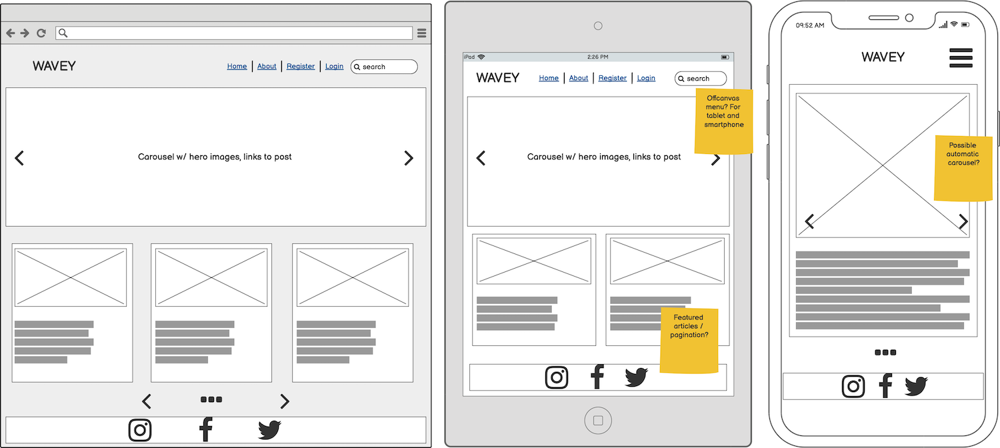

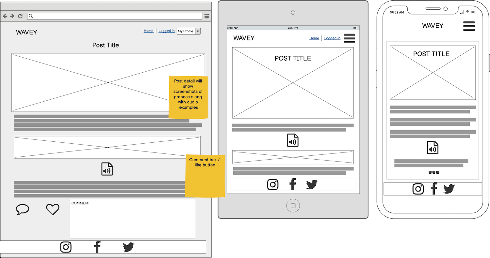

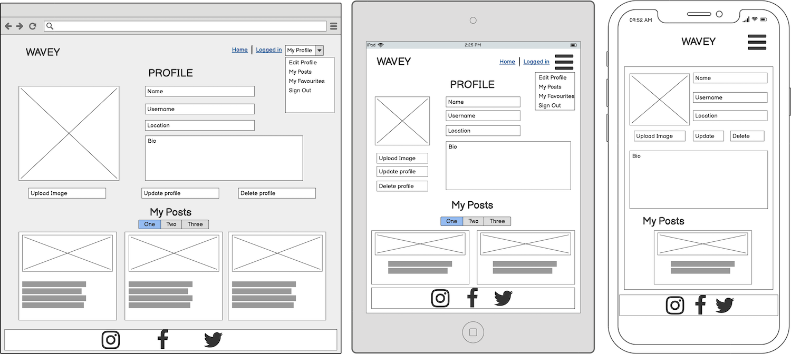
    

#### Database Schema

Custom Profile, Post and Comment models were built on top of the default Django User model, utilising Django's AllAuth to look after the user authentication. As AllAuth works with the generic User model, the Profile model was created to look after some custom fields that were not accounted for. I used [LucidChart](https://lucid.app/) to draw out the schema, listing all the relevant types to each requirement. As the schema was relatively simple, the use of foreign keys only became necessary with the author and post fields in the Post and Comment models respectively. 

Click to expand

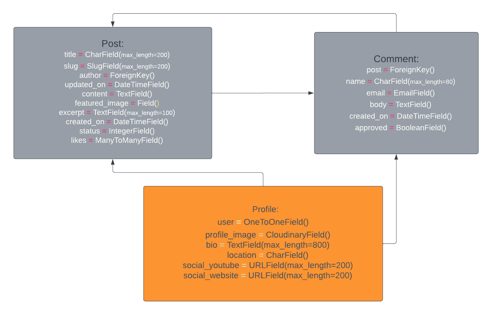

### The Surface Plane

#### Design

Once happy with the initial layout of the site, I focussed on it's design, looking for something clean and concise that put focus on the learning material that would be provided. The logo was created in [Canva](https://canva.com) and this led me towards the colour palette I decided upon:

Expand

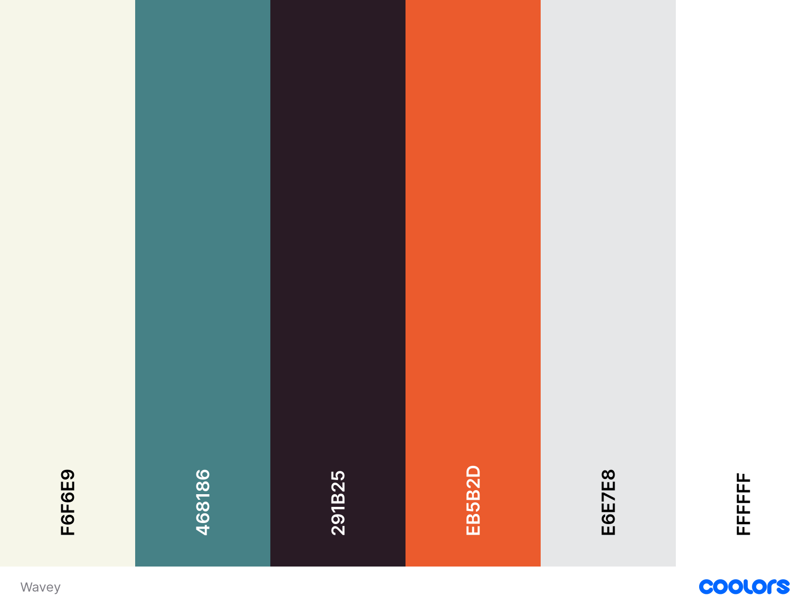

The palette was then ran through the contrast checker and only those combinations that passed at AA or AAA were utilised on the site:

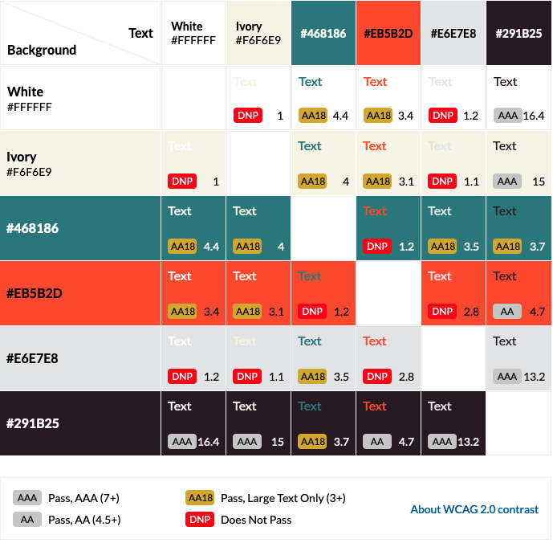

##### Typography 

Google Fonts' Quicksand (Headers), Spline Sans Mono (body text) and sans serif (backup) were used for the fonts. 

## Features

#### Home page

#### Navigation Bar
The main navigation bar appears at the top of the page, clearly displaying the main navigational links users would require.

A user menu is available to users who are logged into the site, users who are not logged in receive a login/register link in its place

The navigation bar and the user menu are fully responsive, adapting to narrower devices by appearing from the right hand side of the screen when the menu button is pressed.

#### Footer
A common footer is utilised through out the site to encourage users to visit the social media sites of the main site. They currently direct users to the generic social media sites, all external links open in a new tab.

#### Post Card

The post card on the home page gives the title, image and author details, along with the creation date and like indicator. A hover effect is used to direct the User easily and a stretched link works over the entirity of the card. 

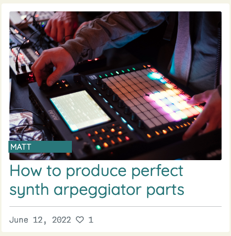

#### User Profile

Users have access to their information by quickly visiting this page. Other registered users who don't own the visited profile page will have access to the page and their social links, but will not see the edit and delete profile buttons. If a User is not logged in, they will not be able to access the page; looking up via URL will redirect them to the login page. 

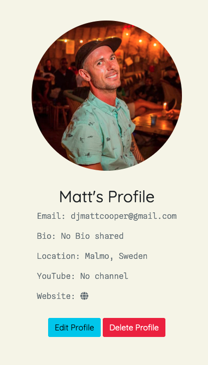

#### Edit Profile Page
Users have the ability to edit their profiles on the site. The edit profile page is clearly laid out, and informs the user of the characters remaining for each field.

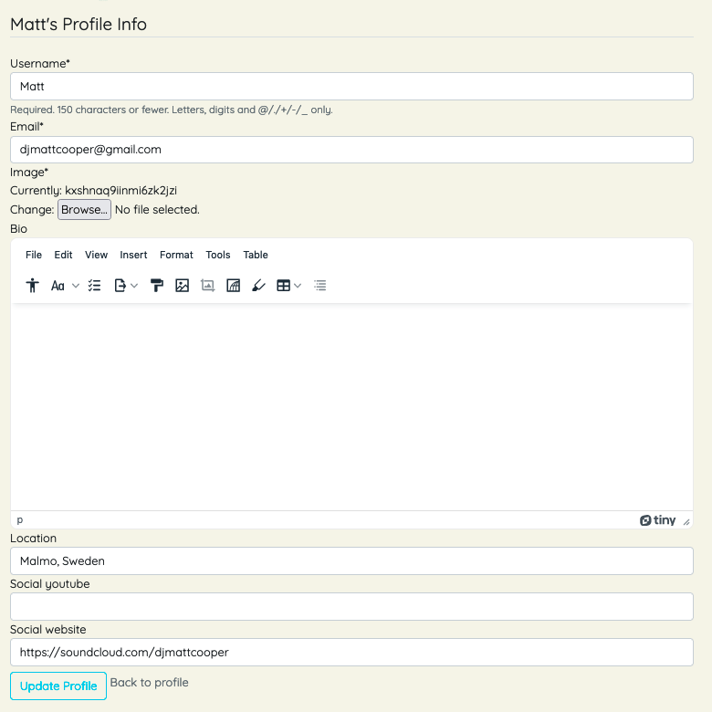

#### Create/Edit Post Page
Users have the ability to create and edit their posts. The create and edit post page is clearly laid out and with the inclusion of the TinyMCE widget, easily modified if necessary. 

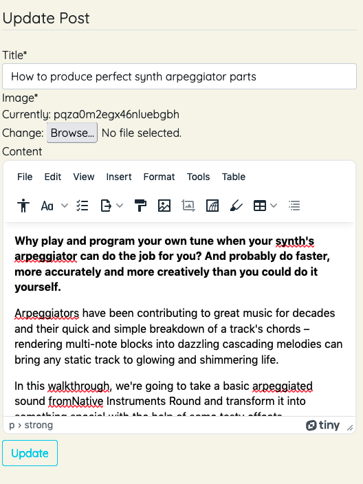

##### Post Form
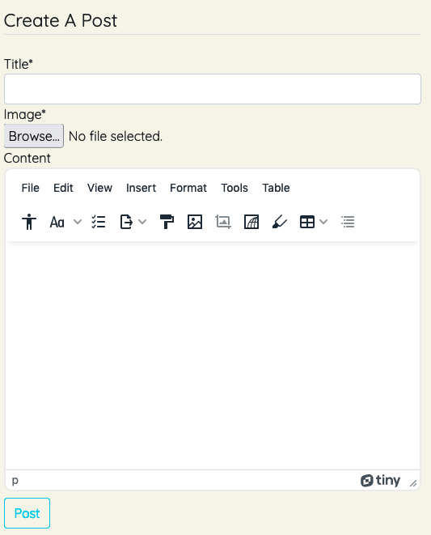

#### Access to Edit Post and Delete Post Functionality
Only the users that create the post can edit it or delete it. If the authorised user is the post author, then the edit and delete post buttons will appear in the masthead of that page.

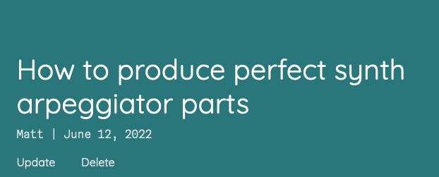

## Future Enhancements

There are several items of functionality I would like to add to the Site, which will be implemented at a later date. These include the remaining Epic on the Kanban board of giving the User the ability to search for posts, either by keyword or by tag. I would also like to add messaging fucntionality between User profiles, and the ability to like and reply to comments directly on the post detail page.

I would also like to enable a feature for site performance that the page doesn't reload when a like or comment is made on a post, taking the User back to the top of the page. After researching this, HTMX seems to resovle this issue but it was too late in development to implement for deadline.

## Testing

### Testing Strategy

A full detailed breakdown of the testing procedures and methodology can be found in the testing.md file [here](TESTING.md).
Seperate to the functionality testing of the site, and the testing of the code, User Stories were used to see if the acceptance criteria was met.

#### Testing Overview

Testing was divided into different sections to ensure everything was tested individually with test cases developed for each area.

A full detailed breakdown of the testing procedures and methodology can be found in the testing.md file [here](TESTING.md)

#### Validator Testing

All Valdiator checks passed on all custom code, excluding some frameworks. Detailed information can be found [here](TESTING.md)

#### Development bugs

One noticable bug that came to light during deployment was on the Register page. In the default UserCreationForm, there is a link at the bottom to take the User back to the . 
However, this link takes you back to the users/register URL. I tried to remove the link from the form, place it outside of the form, and use a different URL but to no avail - the URL in other parts of the site, most notable the Navbar, works as expected. 
 
Looking at the Django documentation, I couldn't see a way of updating the link from auth.contrib.forms path so have left it to work on at a later date. 

Other than this, I believe all other bugs to be out of this site; the major issues I came across are logged in the testing file [here](TESTING.md)

#### Technologies Used

* Python
    * The following python modules were used on this project:
        * asgiref==3.5.1
        * cloudinary==1.29.0
        * dj-database-url==0.5.0
        * dj3-cloudinary-storage==0.0.6
        * Django==3.2.13
        * django-allauth==0.50.0
        * django-crispy-forms==1.14.0
        * django-summernote==0.8.20.0
        * django-tinymce==3.4.0
        * gunicorn==20.1.0
        * oauthlib==3.2.0
        * psycopg2==2.9.3
        * PyJWT==2.3.0
        * python3-openid==3.2.0
        * pytz==2022.1
        * requests-oauthlib==1.3.1
        * sqlparse==0.4.2

* Django
    * Django was used as the main python framework in the development of this project
    * Django AllAuth was utilised to provide enhanced user account management functionality.
* Heroku
    * Was used as the cloud based platform to deploy the site on
* Heroku PostgreSQL
    * Heroku PostgreSQL was used as the database for this project during development and in production.
* JavaScript
    * Custom JavaScript was used for the timeout of system messages presented.
* Bootstrap 5.01
    * Bootstrap was used for general layout and spacing requirements for the site.
* Font Awesome
    * Was used for access to several icons for different sections where icons were appropriate.
* Cloudinary
    * Used for the media storage of profile and post images. 
* CSS
    * Custom css was written for areas on the site to implement custom styling.
* Jinja/Django Templating
    * Jinja/Django templating language was utilised to insert data from the database into the sites pages. It was also utilised to perform queries on different datasets.
* HTML
    * HTML was used as the base language for the templates created for the site.
* TinyMCE
    * Used in the textareas on site where instructed to allow posts to contain external links to images and audio. 
* Summernote
    * Summernote was utilised in the inital stages of the site for use in the admin area. However, as Summernote only accepts images as its media capabilities, it was replaced for the front-end. 

#### Packages Used
* GitHub for writing the code 
* Heroku for the deployment
* Canva for the logo creation
* Balsamiq for the Wireframes
* Lucid for the database schema

#### Resources Used
* Django Documentation was invaluable throughout the development process
* Django AllAuth documentation
* TinyMCE documentation when referring to the JavaScript scripting needed to use the widget without creating a custom form
* The Code Institute material, namely the 'I Think Therefore I Blog' module was utilised throughout the build
* [Codemy's YouTube playlist](https://youtu.be/B40bteAMM_M) on Django blog creation 
* [MusicRadar](https://www.musicradar.com/) and [AttackMag](https://www.attackmagazine.com/) for their kindness in using their amazing resources 

## Deployment

The site was deployed via Heroku, and the live link can be found here - [Wavey](https://wavey-django.herokuapp.com/)

### Project Deployment

To deploy the project through Heroku I followed these steps:
* Sign up / Log in to [Heroku](https://www.heroku.com/)
* From the main Heroku Dashboard page select 'New' and then 'Create New App'
* Give the project a name - I entered wavey-blog and select a suitable region, then select create app. The name for the app must be unique.
* This will create the app within Heroku and bring you to the deploy tab. From the submenu at the top, navigate to the resources tab.
* Add the database to the app, in the add-ons section search for 'Heroku Postgres', select the package that appears and add 'Heroku Postgres' as the database
* Navigate to the setting tab, within the config vars section copy the DATABASE_URL to the clipboard for use in the Django configuration.
* Within the django app repository create a new file called env.py - within this file import the os library and set the environment variable for the DATABASE_URL pasting in the address copied from Heroku. The line should appear as os.environ["DATABASE_URL"]= "Paste the link in here"
* Add a secret key to the app using os.environ["SECRET_KEY"] = "your secret key goes here"
* Add the secret key just created to the Heroku Config Vars as SECRET_KEY for the KEY value and the secret key value you created as the VALUE
* In the settings.py file within the django app, import Path from pathlib, import os and import dj_database_url
* insert the line if os.path.isfile("env.py"): import env
* remove the insecure secret key that django has in the settings file by default and replace it with SECRET_KEY = os.environ.get('SECRET_KEY')
* replace the databases section with DATABASES = { 'default': dj_database_url.parse(os.environ.get("DATABASE_URL"))} ensure the correct indentation for python is used.
* In the terminal migrate the models over to the new database connection
* Navigate in a browser to cloudinary, log in, or create an account and log in. 
* From the dashboard - copy the CLOUDINARY_URL to the clipboard
* in the env.py file created earlier - add os.environ["CLOUDINARY_URL"] = "paste in the Url copied to the clipboard here"
* In Heroku, add the CLOUDINARY_URL and value copied to the clipboard to the config vars
* Also add the KEY - DISABLE_COLLECTSTATIC with the Value - 1 to the config vars
* this key value pair must be removed prior to final deployment
* Add the cloudinary libraries to the list of installed apps, the order they are inserted is important, 'cloudinary_storage' goes above 'django.contrib.staitcfiles' and 'cloudinary' goes below it.
* in the Settings.py file - add the STATIC files settings - the url, storage path, directory path, root path, media url and default file storage path.
* Link the file to the templates directory in Heroku TEMPLATES_DIR = os.path.join(BASE_DIR, 'templates')
* Change the templates directory to TEMPLATES_DIR - 'DIRS': [TEMPLATES_DIR]
* Add Heroku to the ALLOWED_HOSTS list the format will be the app name given in Heroku when creating the app followed by .herokuapp.com
* In your code editor, create three new top level folders, media, static, templates
* Create a new file on the top level directory - Procfile
* Within the Procfile add the code - web: guincorn PROJECT_NAME.wsgi
* In the terminal, add the changed files, commit and push to GitHub
* In Heroku, navigate to the deployment tab and deploy the branch manually - watch the build logs for any errors.
* Heroku will now build the app for you. Once it has completed the build process you will see a 'Your App Was Successfully Deployed' message and a link to the app to visit the live site.

#### Forking the repository
By forking the GitHub Repository you can make a copy of the original repository to view or change without it effecting the original repository
This can be done by
    * Log into GitHub or create an account.
    * Locate the repository at https://github.com/YesCoops/wavey.
    * At the top of the repository, on the right side of the page, select "Fork" from the buttons available.
    * A copy of the repository should now be created in your own repository.

#### Create a clone of this repository
Creating a clone enables you to make a copy of the repository at that point in time - this lets you run a copy of the project locally:
This can be done by:
* Navigate to https://github.com/
* click on the arrow on the green code button at the top of the list of files
* select the clone by https option and copy the URL it provides to the clipboard
* navigate to your code editor of choice and within the terminal change the directory to the location you want to clone the repository to.
* type 'git clone' and paste the https link you copied from github
* press enter and git will clone the repository to your local machine

### Acknowledgements

I'd like to thank the following:

* Antonio Rodrigues for all his help during this project.
* The Tutors at Code Institute, who are there for you at your deepest times of need. 
* My love, Mor and our incredible son, Leo, for whom I wouldn't have the drive and persistence to achieve any of this. 
