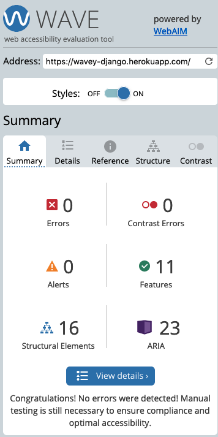
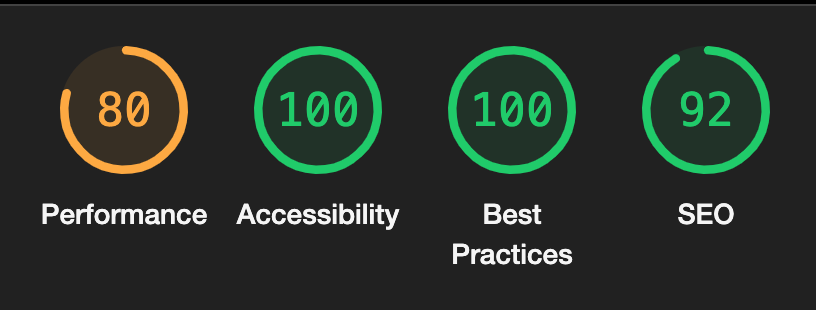
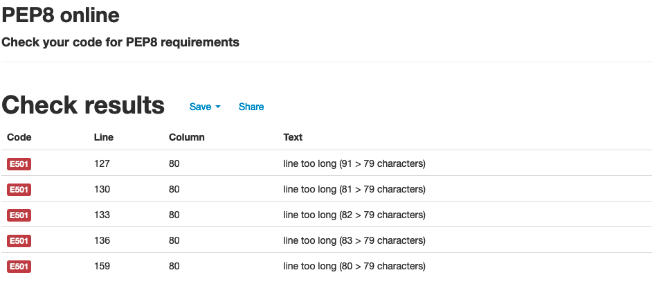

# Manuel Testing
* [Manuel Testing](#manuel-testing)
  * [Bugs and Fixes During the Development Process](#bugs-and-fixes-during-the-development-process)
* [Wave Aim Accessibility checker:](#wave-aim-accessibility-checker)
* [Lighthouse](#lighthouse)
* [Validators](#validators)
  * [HTML:](#html)
  * [CSS:](#css)
  * [JS:](#js)
  * [PEP8:](#pep8)
* [Manual testing](#manual-testing)
  * [As an **Admin** I can...](#as-an-admin-i-can)
  * [As an **Unregistered User** I can...](#as-an-unregistered-user-i-can)
  * [As a **Registered User** I can...](#as-a-registered-user-i-can)

## Bugs and Fixes During the Development Process

* Issue - Register form was returning ValuError as didn't return HttpResponse object when invalid data was input to create a User.  
* Fix - In register function the render return was incorrectly indented when the if statement wasn't met. Amending this resolved the issue and user validation was restored.

* Issue - When submitting a new post an integrity error for a duplicate primary key was being shown. The duplicate being created was an empty string, causing an error for the super().save() method when calling the form_valid function. 
* Fix - Creating a save function in the Post model which looked at the newly-created slug, stripping any empty space and replacing with a hyphen, then calling the super().save() resolved the issue.

* Issue - When TinyMCE widget was installed in the Create Post view, when you tried to submit a post with all required fields filled the submit request was not working. 
* Fix - Setting the content CharField in the Post model to blank="null" resolved the issue. 

* Issue - Featured image field was not uploading related media to cloudinary when creating a Post, thus not replacing the masthead placeholder image as desired. 
* Fix - Adding the necessary enctype="multipart/form-data" to the relevant forms sent images to cloudinary and therefore to the related post.


# Wave Aim Accessibility checker:
* After resolving low contrast issues and several missing alt tags, the WAVE report now comes back clear of all errors and contrast issues along all pages. 
   


# Lighthouse
The lighthouse test showed varying performance scores on each post-detail page due to the varying amounts of media used over each post. As this would be uploaded by the USer on a case-by-case basis, it would be hard to control in these development stages. For a future update I would use cloudinary to resize and compress uploaded images to improve load time. 

In general Mobile scores were lower in performance for two main reasons, cdn imports from bootstrap, jquery, and the already compressed (multiple times hero images). As a future development, I would be firstly looking to reduce load time by replacing the few lines of jquery in my custom JS file with vanilla JS instead. and secondly I would change the hero image to be imported with CSS so the second hero image (default to display: none) didn't slow down the page load time.




# Validators
## [HTML](https://validator.w3.org):

All pages were free from errors.


## [CSS](https://jigsaw.w3.org/css-validator/):
Checking by URL there were a lot of errors coming from the bootstrap and font awesome source code.  However my CSS file was tested by direct upload was found to be free from errors
Valid CSS!
<p>
    <a href="https://jigsaw.w3.org/css-validator/check/referer">
        
    </a>
</p>


## [JS](https://jshint.com/):
All custom JS was found without errors. 

## [PEP8](http://pep8online.com): 
The only error I found was in settings.py with ``` AUTH_PASSWORD_VALIDATORS ``` & ``` STATICFILES_STORAGE ```.   



Django seems to think shortening these lines is ill advisable. For this reason, I left them to be longer than 80 characters. 

# Manual testing
Below is a summary of how I manually tested each user story.

## As an **Admin** I can...

Here I have only tested the admin panel relating to the JOB_SEARCH app, as the other sections relate to imported libraries.

| Checked | ...**use a text editor within the admin panel** so that **I can create a post** |
|:-------:|:--------|
| &check; | Can add a job post successfully from the admin panel using the summernote editor |

| Checked | ...**Log into a user interface** so that **I can easily manage data via a user interface** |
|:-------:|:--------|
| &check; | Can Log in to admin panel successfully |
| &check; | Changes to any data are reflected in the database |

| Checked | ... **Filter and search all custom models from the admin page** so that **I can utilize the admin page to review, edit and delete data quickly.** |
|:-------:|:--------|
| **Jobs** |  |
| &check; | Can search post by title |
| &check; | Can search post by author |
| &check; | Can filter by a user to see which posts are liked|
| &check; | Can filter by date created |
| &check; | Can filter by date posted to see recent posts |
| &check; | Can filter by status to see hidden posts/comments |
| &check; | Can filter by approved to know what needs approving still |
| &check; | Can filter by username and see their posts|
| **Comments** |  |
| &check; | Can search username |
| &check; | Can filter by date created  |


| Checked | ...**Approve new posts offered by the community** so that **I can ensure that posts are not malicious, false, misleading, or incomplete.** |
|:-------:|:--------|
| &check; | Can approve a post individually |
| &check; | Can approve multiple posts |

| Checked | ...**Delete a post** so that **I can remove posts that are no longer relevant to the site.** |
|:-------:|:--------|
| &check; | Can delete from the admin panel |
| &check; | Can change status to remove post for review |
| &check; | Deletion is reflected in the database |


## As an **Unregistered User** I can...

| Checked | ...**quickly determine the subject of the site** so that **from the landing page, I can see if I want to continue spending my time on this site and register** |
|:-------:|:--------|
| &check; | Can see the theme of the site from the landing page  |
| &check; | Quickly navigate the Site to see it's content |

| Checked | ...**register for an account** so that **I can enjoy a personalized experience as a User** |
|:-------:|:--------|
| &check; | Can sign up for a new account with email  |
| &check; | Logged in and get redirected to the login page upon successful signup |
| &check; | Able to start using the site features immediately |
| &check; | New user entry visible from the database after registration |
| &check; | Unable to register with a duplicate email or username |

| Checked | ...**browse the posts** so that **I can see if I wish to register with the site or not** |
|:-------:|:--------|
| &check; | Can see the post previews and detailed posts |
| &check; | Can see I need to sign up/log in to use more features |

## As a **Registered User** I can... 

| Checked | ...**Create a Post** so that **I can share my knowledge with other Users** |
|:-------:|:--------|
| &check; | Can create a post form the Create a Post page  |
| &check; | Once created post is visible on index page |
| &check; | If updated the revised post is shown |
| &check; | If deleted the post is removed from page and database |


| Checked | ...**leave notes specific to the job on my pinboard** so that **I can keep track of specific milestones in the application process** |
|:-------:|:--------|
| &check; | When job pinned Notes form and accordion are visible |
| &check; | No notes section from full spec page when job unpinned |
| &check; | The notes section display can be toggled with the toggle switch |
| &check; | When on smaller screen sizes, there is a button to direct the user to the notes section below the full spec |
| &check; | Can successfully leave a note from the full job spec  |
| &check; | Can mark Note as insight and background color of related accordion-item changes to yellow with an icon in the heading |
| &check; | Can see each note/item heading in the accordion |
| &check; | When expanding one section of the accordion, any previous one closes |
| &check; | Notes/insights can only be seen by the user who left them |
| &check; | Notes/insights left are reflected in the database |
| &check; | If a user is not logged in and tries to use the URL to access the edit note form, they see a custom error page |


| Checked |  ...**See balanced forms with an included text editor where necessary** so that **I can have a pleasant visual experience across the site, and my posts look how i envisaged.** |
|:-------:|:--------|
| &check; | Post form formatted and includes TinyMCE widget for text area entry |
| &check; | Comment form formatted and includes TinyMCE widget for text area entry |
| &check; | Profile Form formatted |
| &check; | Edit Profile form formatted with TinyMCE widget for bio |


| Checked | ...**See appealing colors and uniform style themes**|
|:-------:|:--------|
| &check; |  Colors pass contrast test |
| &check; | Colors and styles are consistent across the site |

| Checked | ...**Access the site from any size screen and still have a pleasant experience on the site** so that **I am not restricted to which devices I can use on the site** |
|:-------:|:--------|
| &check; | Home page is responsive from 320px up |
| &check; | Post Detail is responsive from 320px up |
| &check; | Create a Post is responsive from 320px up |
| &check; | Edit a Post is responsive from 320px up |
| &check; | Register page is responsive from 320px up |
| &check; | Login page is responsive from 320px up |
| &check; | Profile page is responsive from 320px up |
| &check; | Edit Profile page is responsive from 320px up |
| &check; | Navbar is responsive from 320px up |
| &check; | Footer is responsive from 320px up |
| &check; | Edit form is responsive from 320px up |
| &check; | Sign out page is responsive from 320px up |
| &check; | Sign up page is responsive from 320px up |
| &check; | 404 page is responsive from 320px up |
| &check; | 500 page is responsive from 320px up |
| &check; | Pagination bar is responsive from 320px up |

| Checked | ...**type a URL into the web browser** so that **I can access the site's various pages** |
|:-------:|:--------|
| &check; | All pages can be accessed by their URL when logged in |
| &check; | When logged out, only the landing page visible|
| &check; | Message displayed if a user is logged out and tries to access a URL which is denied |

| Checked | ...**see uniformity on each page and clearly distinguish the content subject** so that **I can quickly and familiarly navigate the page.** |
|:-------:|:--------|
| &check; | Navbar on all pages the same |
| &check; | Footer on all pages the same |
| &check; | Styling of all pages follow a theme |


## As a **Site User** I can...
| Checked | ...**see appropriate responses upon specific interactions with the site** so that **I know my edit, deletion, submission has been successful.**|
|:-------:|:--------|
| &check; | When creating a post the success message shows on screen|
| &check; | When updating a post the success message shows on screen|
| &check; | When deleting a post the success message shows on screen|
| &check; | When commenting on a post the success message shows on screen|
| &check; | When liking on a post the heart icon changes colour|
| &check; | When unliking on a post the heart icon changes colour|
| &check; | When creating a profile the success message shows on screen|
| &check; | When updating a profile the success message shows on screen|
| &check; | When deleting a profile the success message shows on screen|
| &check; | When logging in the success message shows on screen|
| &check; | When logging out the success message shows on screen|

[Back to Readme](README.md)